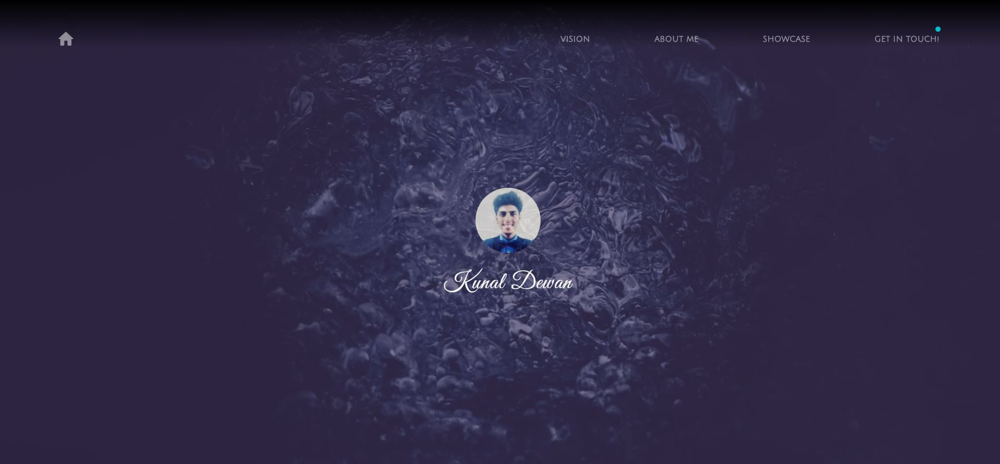
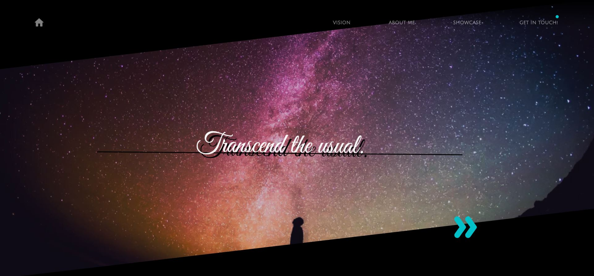
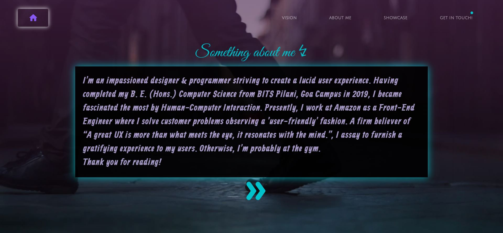
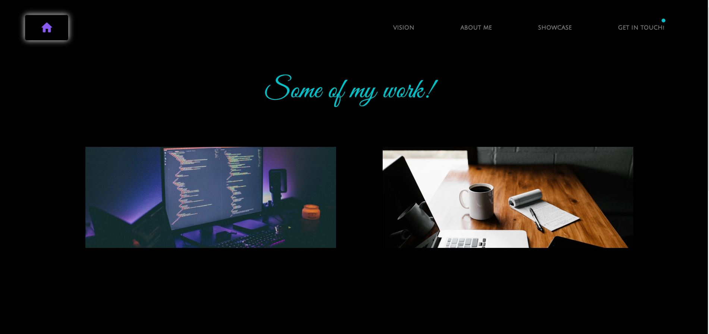
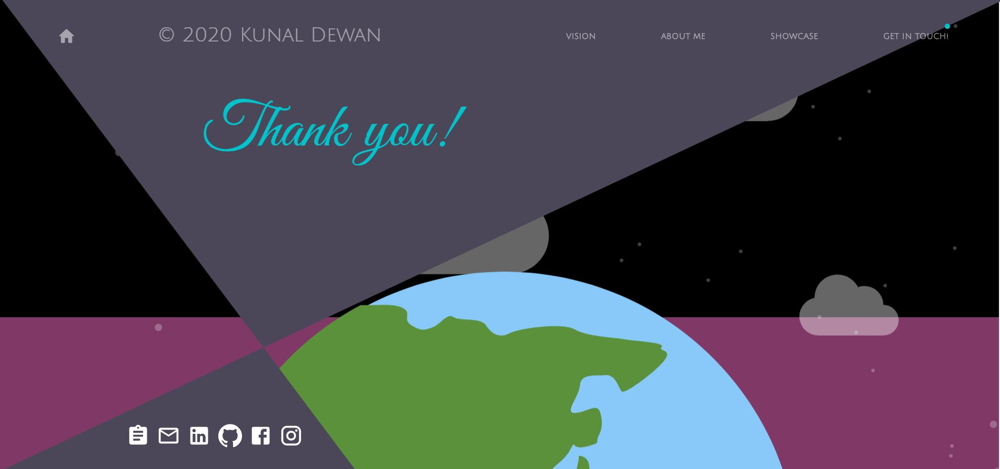
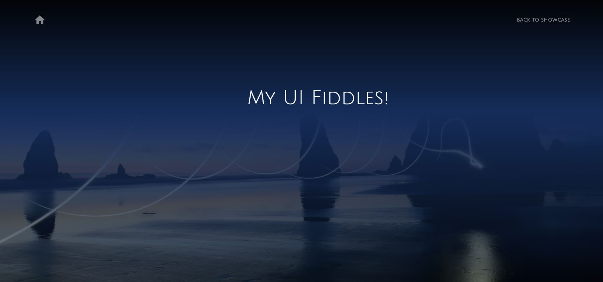

# MyLandingPage
Development of my personal website using Gatsby ( https://www.gatsbyjs.org/ )

## Pages
### Home Page 

### Vision Page 

### About Me Page 

### Projects Showcase Page 

### Contact Page 

### Project Page Sample 1

### Project Page Sample 2

## Rough Sketches & Wireframes
### Home Page

### Vision Page

More: https://github.com/eVocaTiv/UX-Design-Practice/tree/master/MyWebsiteWireframes
