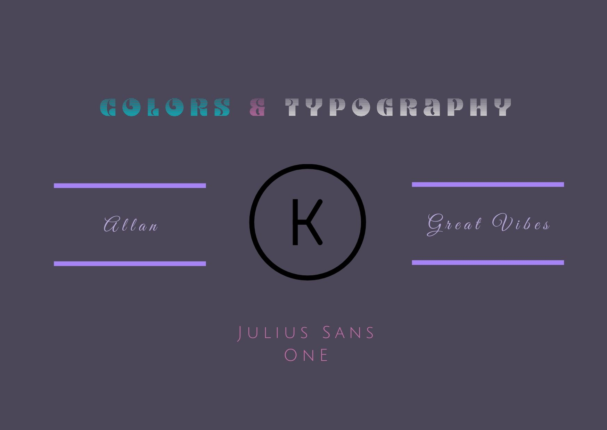

# MyLandingPage
Development of my personal website using Gatsby ( https://www.gatsbyjs.org/ )

## Colors & Typography

## Pages ( Initial concept )
### Home Page 

### Vision Page 

### About Me Page 

### Projects Showcase Page 

### Contact Page 

### Project Page Sample 1

### Project Page Sample 2

### A 3D Model effect created using GLTFJSX and three.js
(Presently taken down from showcase for performance purposes [GPU Heavy] )

## Rough Sketches & Wireframes

## Original Single Page App Idea

### Home Page

### Vision Page

Old wireframes: https://github.com/eVocaTiv/UX-Design-Practice/tree/master/MyWebsiteWireframes
